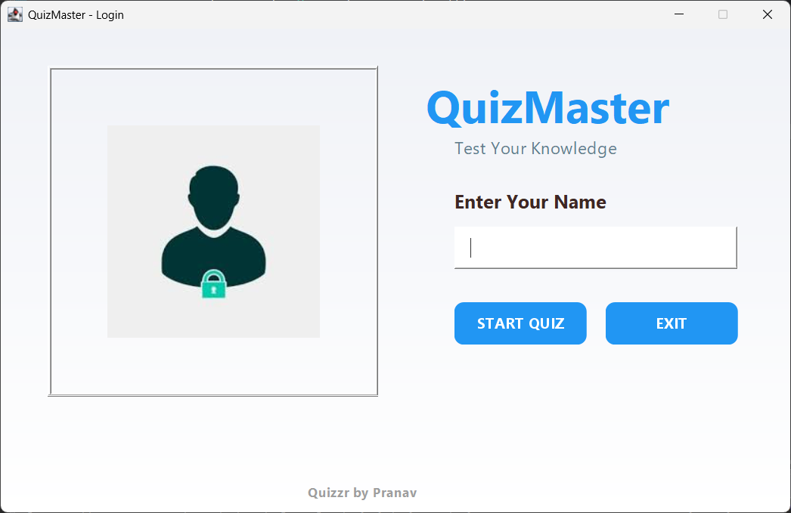

# Quiz Application

A full-stack Java quiz application with a modern Swing UI, MySQL database integration, user management, dynamic questions, and persistent score tracking. Ideal for learning and demonstrating Java desktop development, JDBC, and database-driven applications.

---

## 🚀 Features

- Modern Java Swing user interface with custom styling and responsive design
- MySQL database integration for persistent storage
- User registration and profile management
- Dynamic question loading from the database (not hardcoded)
- Score tracking and best score display per user
- Randomized questions for each quiz session
- Detailed statistics and quiz history
- Cross-platform: works on Windows, macOS, and Linux

---

## 📸 Demo


*Login Page*


*Rules Page*


*Quiz Page*

---

## 🛠️ Tech Stack
- Java 8+
- Java Swing (UI)
- MySQL (database)
- JDBC (database connectivity)
- Eclipse or VS Code (recommended IDEs)

---

## 🗄️ Database Setup

1. **Install MySQL** and ensure it is running on `localhost:3306`.
2. Use the provided [`schema.sql`](schema.sql) to create the database and tables:
   ```bash
   mysql -u root -p < schema.sql
   ```
3. (Optional) Use [`seed.sql`](seed.sql) to add sample data:
   ```bash
   mysql -u root -p quiz_app < seed.sql
   ```
4. See [`migrations/`](migrations/) for schema evolution and [`README.sql`](README.sql) for example queries.

---

## 💻 How to Run

### **In Eclipse:**
1. Import the project (**File > Import > Existing Projects into Workspace**).
2. Right-click the project > **Build Path > Configure Build Path** > **Add External JARs...**
3. Add `lib/mysql-connector-j-8.2.0.jar` to the **Classpath**.
4. Right-click `Login.java` > **Run As > Java Application**.

### **In VS Code or Terminal:**
```bash
# Compile
javac -cp "src;lib/mysql-connector-j-8.2.0.jar" src/com/java/quizApplication/*.java
# Run
java -cp "src;lib/mysql-connector-j-8.2.0.jar" com.java.quizApplication.Login
```

---

## 📖 How to Use

- Start the application. The login page will appear.
- Enter your name and proceed to the rules screen.
- After reading the rules, update your profile if needed.
- The quiz consists of 10 random multiple-choice questions from the database.
- You have 15 seconds per question.
- Your score and best score are saved and displayed at the end.
- All data is stored in MySQL for persistence and analytics.

---

## 🤝 Contributing

1. Fork this repository.
2. Create a new branch for your changes.
3. Commit your changes to that branch.
4. Push the branch to your forked repository.
5. Open a pull request describing your changes.

---

## 📄 License

This project is licensed under the **MIT License**.

You are free to use, modify, and distribute this code for personal or commercial use. The original author is not responsible for any issues that may arise from using the code.

---

**Thanks for checking out QuizMaster!**
